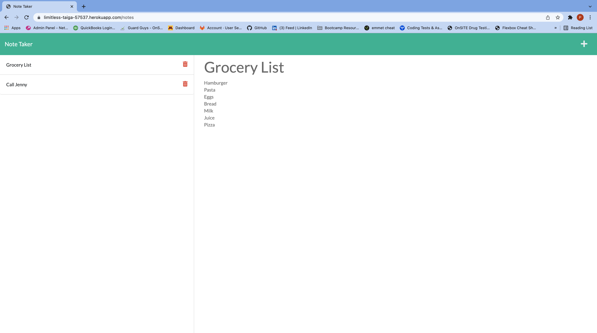

 [](https://opensource.org/licenses/MIT)
 # Note Taker
 ## *Table of Contents*
1. [Description](#description)
2. [Usage Information](#usage-information)
3. [API Endpoints](#api-endpoints)
3. [Installation Instructions](#installation-instructions)
4. [Questions](#questions)
5. [License Info](#license-info)

 _ _ _
 ## *Description*
 ### This is my week 11 bootcamp challenge submission. Which was to build the back end utilizing Express.js, connect the two so the note take will save and retrieve note data from a JSON file.  As a bonus, add the ability to delete notes. 
 

 _ _ _
 ## *Usage Information*
  This project is deployed live on Heroku at https://limitless-taiga-57537.herokuapp.com/.  To run locally you will need download the project from GitHub at https://github.com/pjlawler/taking-notes along with installing npm as it uses Node.js, Express.js and UUID packages.

_ _ _
## *API Endpoints*

### Retrieve All Notes
#### GET method example: https://limitless-taiga-57537.herokuapp.com/api/notes
#### JSON Format
```
{
  "notes": [
    {
      "title": "Grocery List",
      "text": "Eggs\nBread\nMilk\nJuice\nPizza",
      "id": "ccb7ca52-ee05-4ad6-b331-db1ff2d486af"
    }
  ]
}
```

### Save new note
#### POST method exmample: https://limitless-taiga-57537.herokuapp.com/api/notes

### Delete a note by ID
#### DELETE method example https://limitless-taiga-57537.herokuapp.com/api/notes/id

_ _ _
## *Installation Instructions*
  npm install

_ _ _
## *Questions*
###   For questions or comments concerning this project please contact, Patrick Lawler, the author, owner and manager the work via either github or email. Links for each are listed below.

 - GitHub: [pjlawler](https://github.com/pjlawler)
 - eMail: patlaw777@icloud.com
 _ _ _
 ## *License Info*
  [](https://opensource.org/licenses/MIT)  Copyright Ⓒ 2022 Patrick Lawler
      
    Permission is hereby granted, free of charge, to any person obtaining a copy of this software and associated documentation files (the "Software"), to deal in the Software without restriction, including without limitation the rights to use, copy, modify, merge, publish, distribute, sublicense, and/or sell copies of the Software, and to permit persons to whom the Software is furnished to do so, subject to the following conditions:
    
    The above copyright notice and this permission notice shall be included in all copies or substantial portions of the Software.
    
    THE SOFTWARE IS PROVIDED "AS IS", WITHOUT WARRANTY OF ANY KIND, EXPRESS OR IMPLIED, INCLUDING BUT NOT LIMITED TO THE WARRANTIES OF MERCHANTABILITY, FITNESS FOR A PARTICULAR PURPOSE AND NONINFRINGEMENT. IN NO EVENT SHALL THE AUTHORS OR COPYRIGHT HOLDERS BE LIABLE FOR ANY CLAIM, DAMAGES OR OTHER LIABILITY, WHETHER IN AN ACTION OF CONTRACT, TORT OR OTHERWISE, ARISING FROM, OUT OF OR IN CONNECTION WITH THE SOFTWARE OR THE USE OR OTHER DEALINGS IN THE SOFTWARE.